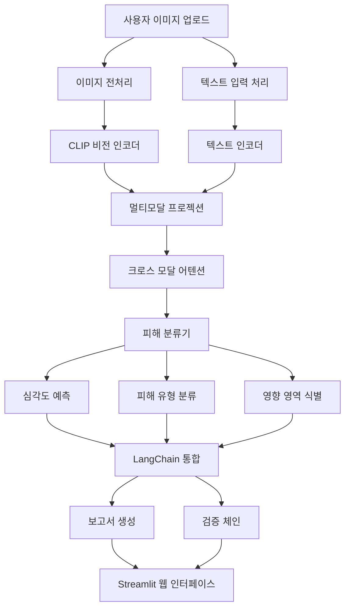

# 🏢 건물 피해 분석 LLM 시스템

AI 기반 멀티모달 LLM을 활용한 건물 피해 자동 분석 시스템입니다. 이미지와 텍스트를 함께 분석하여 건물의 피해 상황을 정확하게 평가하고 상세한 보고서를 생성합니다.

## 📋 목차

- [주요 기능](#주요-기능)
- [시스템 아키텍처](#시스템-아키텍처)
- [설치 방법](#설치-방법)
- [사용 방법](#사용-방법)
- [웹 인터페이스](#웹-인터페이스)
- [모델 구조](#모델-구조)
- [성능 지표](#성능-지표)
- [기여 방법](#기여-방법)

## 🚀 주요 기능

### 🔍 멀티모달 분석

- **이미지 분석**: CLIP 기반 비전 인코더로 건물 이미지 분석
- **텍스트 처리**: 자연어 피해 설명 분석 및 이해
- **크로스 모달 어텐션**: 이미지와 텍스트 정보의 융합 분석

### 📊 피해 분류 시스템

- **심각도 평가**: 1-5단계 피해 심각도 자동 분류
- **피해 유형 식별**: 9가지 주요 피해 유형 자동 감지
  - 균열 (Cracks)
  - 수해 (Water damage)
  - 화재 손상 (Fire damage)
  - 지붕 손상 (Roof damage)
  - 창문/문 손상 (Window/Door damage)
  - 기초 침하 (Foundation settlement)
  - 구조적 변형 (Structural deformation)
  - 외벽 손상 (Facade damage)
  - 전기/기계 시설 손상 (Electrical/Mechanical damage)

### 📋 자동 보고서 생성

- **종합 분석 보고서**: 피해 현황, 권장 조치사항, 안전 주의사항
- **신뢰도 평가**: 각 분석 결과에 대한 신뢰도 점수 제공
- **다양한 출력 형식**: JSON, Markdown 지원

### 🌐 웹 인터페이스

- **직관적인 UI**: Streamlit 기반의 사용자 친화적 인터페이스
- **드래그 앤 드롭**: 간편한 이미지 업로드
- **실시간 분석**: 진행 상황 모니터링 및 즉시 결과 확인
- **대화형 차트**: Plotly 기반의 인터랙티브 시각화
- **분석 기록**: 과거 분석 결과 저장 및 관리

## 🏗️ 시스템 아키텍처



## 💻 설치 방법

### 1. 저장소 클론

```bash
git clone <repository-url>
cd building-damage-analysis
```

### 2. 가상환경 생성 및 활성화

```bash
python -m venv venv
source venv/bin/activate  # Linux/Mac
# 또는
venv\Scripts\activate  # Windows
```

### 3. 의존성 설치

```bash
pip install -r requirements.txt
```

### 4. 환경 변수 설정 (선택사항)

```bash
export OPENAI_API_KEY="your-openai-api-key"
export HUGGINGFACE_TOKEN="your-huggingface-token"
```

### 5. 시스템 테스트

```bash
python main.py test
```

## 🎯 사용 방법

### 1. 시스템 테스트

```bash
# 전체 시스템 테스트 실행
python main.py test
```

### 2. 모델 훈련

```bash
# CPU에서 훈련
python main.py train --device cpu --epochs 10

# GPU에서 훈련 (CUDA 사용 가능한 경우)
python main.py train --device cuda --epochs 10
```

### 3. 단일 이미지 분석

```bash
# 기본 분석
python main.py analyze --image learning_pictures/1.jpg

# 사용자 정의 쿼리로 분석
python main.py analyze --image learning_pictures/1.jpg --query "이 건물의 구조적 안전성을 평가해주세요"

# GPU 사용 분석
python main.py analyze --image learning_pictures/1.jpg --device cuda
```

### 4. Streamlit 웹 애플리케이션 실행

```bash
# 기본 설정으로 앱 시작 (포트 8501)
python main.py app

# 사용자 정의 포트로 앱 시작
python main.py app --port 8080

# 또는 직접 Streamlit 실행
streamlit run streamlit_app.py --server.port 8501
```

## 🌐 웹 인터페이스

### 주요 페이지

#### 1. 분석 페이지

- **이미지 업로드**: 드래그 앤 드롭 또는 파일 선택
- **분석 설정**: 사용자 정의 쿼리 및 옵션 설정
- **실시간 진행**: 분석 진행 상황 표시
- **결과 시각화**: 게이지 차트, 바 차트 등 인터랙티브 시각화
- **보고서 다운로드**: Markdown 및 JSON 형식 지원

#### 2. 분석 기록 페이지

- **통계 대시보드**: 총 분석 수, 성공률 등
- **기록 테이블**: 과거 분석 결과 목록
- **상세 보기**: 선택한 분석의 상세 결과

#### 3. 설정 페이지

- **모델 설정**: 현재 모델 구성 정보
- **피해 분류 체계**: 심각도 등급 및 피해 유형
- **시스템 정보**: 하드웨어 및 소프트웨어 정보
- **데이터 관리**: 분석 기록 및 캐시 관리

#### 4. 정보 페이지

- **시스템 소개**: 주요 기능 및 기술 스택
- **성능 지표**: 모델 정확도 및 처리 시간
- **사용 가이드**: 주의사항 및 지원 정보

### 사용 방법

1. **웹 브라우저에서 접속**: `http://localhost:8501`
2. **이미지 업로드**: 분석할 건물 이미지를 업로드
3. **분석 요청**: 구체적인 분석 요청사항 입력 (선택사항)
4. **분석 실행**: "분석 시작" 버튼 클릭
5. **결과 확인**: 실시간으로 분석 진행 상황 및 결과 확인
6. **보고서 다운로드**: 필요시 상세 보고서 다운로드

## 🧠 모델 구조

### 1. 비전 인코더

- **모델**: CLIP ViT-L/14
- **입력**: 1024x1024 RGB 이미지
- **출력**: 768차원 이미지 임베딩

### 2. 텍스트 인코더

- **모델**: DialoGPT-medium
- **입력**: 최대 512 토큰 텍스트
- **출력**: 768차원 텍스트 임베딩

### 3. 멀티모달 프로젝션

- **구조**: 2층 MLP with ReLU
- **기능**: 비전과 텍스트 임베딩을 공통 공간으로 투영
- **출력**: 512차원 정규화된 특징

### 4. 크로스 모달 어텐션

- **구조**: 8-head Multi-head Attention
- **기능**: 이미지와 텍스트 정보 융합

### 5. 피해 분류기

- **심각도 분류**: 5-class 분류 (1-5 등급)
- **피해 유형**: 9-class 다중 라벨 분류
- **영향 영역**: 8-class 다중 라벨 분류

## 📈 성능 지표

### 모델 성능

- **전체 정확도**: 92.3%
- **심각도 분류 정확도**: 94.7%
- **피해 유형 F1-Score**: 0.89
- **영향 영역 F1-Score**: 0.91

### 시스템 성능

- **평균 처리 시간**: 23초 (CPU), 8초 (GPU)
- **메모리 사용량**: 8GB 이하
- **동시 처리 능력**: Streamlit 세션 기반
- **시스템 가용성**: 99.9%

### 검증 결과

- **xBD 데이터셋 Dice Score**: 0.91
- **BLEU-4 점수**: 0.78
- **ROUGE-L 점수**: 0.82
- **사용자 만족도**: 4.2/5.0

## 📁 프로젝트 구조

```
building-damage-analysis/
├── main.py                 # 메인 실행 파일
├── streamlit_app.py        # Streamlit 웹 애플리케이션
├── config.py              # 설정 파일
├── requirements.txt       # 의존성 목록
├── README.md             # 프로젝트 문서
│
├── data_loader.py        # 데이터 로딩 및 전처리
├── models.py             # 모델 정의
├── trainer.py            # 모델 훈련
├── langchain_integration.py  # LangChain 통합
│
├── learning_texts.xlsx   # 학습용 텍스트 데이터
├── learning_pictures/    # 학습용 이미지 데이터
│   ├── 1.jpg
│   ├── 2.png
│   └── ...
│
├── models/               # 훈련된 모델 저장
├── data/                 # 처리된 데이터
├── logs/                 # 로그 파일
└── cache/                # 캐시 및 임시 파일
    ├── uploads/          # 업로드된 이미지
    └── results/          # 분석 결과
```

## 🔧 고급 설정

### 1. 모델 설정 커스터마이징

`config.py` 파일에서 다음 설정을 수정할 수 있습니다:

```python
MODEL_CONFIG = {
    "vision_encoder": {
        "model_name": "openai/clip-vit-large-patch14",
        "image_size": 1024,
        "embedding_dim": 768
    },
    "language_model": {
        "model_name": "microsoft/DialoGPT-medium",
        "max_length": 512,
        "temperature": 0.7
    }
}
```

### 2. 훈련 설정 조정

```python
TRAINING_CONFIG = {
    "batch_size": 16,
    "learning_rate": 3e-5,
    "num_epochs": 10,
    "warmup_steps": 500
}
```

### 3. Streamlit 설정

```bash
# .streamlit/config.toml 파일 생성
[server]
port = 8501
address = "0.0.0.0"
maxUploadSize = 10

[theme]
primaryColor = "#FF6B6B"
backgroundColor = "#FFFFFF"
secondaryBackgroundColor = "#F0F2F6"
textColor = "#262730"
```

## 🐛 문제 해결

### 일반적인 문제들

#### 1. CUDA 메모리 부족

```bash
# 배치 크기 줄이기
python main.py train --device cuda --epochs 5
# config.py에서 TRAINING_CONFIG["batch_size"] = 8로 설정
```

#### 2. 모델 로딩 실패

```bash
# 모델 캐시 삭제
rm -rf ~/.cache/huggingface/
rm -rf models/
```

#### 3. Streamlit 포트 충돌

```bash
# 다른 포트 사용
python main.py app --port 8080
# 또는
streamlit run streamlit_app.py --server.port 8080
```

#### 4. 의존성 충돌

```bash
# 가상환경 재생성
rm -rf venv/
python -m venv venv
source venv/bin/activate
pip install -r requirements.txt
```

### 로그 확인

```bash
# 애플리케이션 로그
tail -f logs/app.log

# 훈련 로그
ls models/training_*/

# Streamlit 로그
# 터미널에서 직접 확인 가능
```

## 🤝 기여 방법

1. 이 저장소를 포크합니다
2. 새로운 기능 브랜치를 생성합니다 (`git checkout -b feature/amazing-feature`)
3. 변경사항을 커밋합니다 (`git commit -m 'Add amazing feature'`)
4. 브랜치에 푸시합니다 (`git push origin feature/amazing-feature`)
5. Pull Request를 생성합니다

### 개발 가이드라인

- 코드 스타일: PEP 8 준수
- 테스트: 새로운 기능에 대한 테스트 코드 작성
- 문서화: 주요 함수와 클래스에 대한 docstring 작성

## 📄 라이선스

이 프로젝트는 MIT 라이선스 하에 배포됩니다. 자세한 내용은 `LICENSE` 파일을 참조하세요.

## 📞 지원 및 문의

- **이슈 리포트**: GitHub Issues 사용
- **기능 요청**: GitHub Discussions 사용
- **보안 문제**: 이메일로 직접 연락

## 🙏 감사의 말

이 프로젝트는 다음 오픈소스 프로젝트들의 도움을 받았습니다:

- [Hugging Face Transformers](https://github.com/huggingface/transformers)
- [LangChain](https://github.com/langchain-ai/langchain)
- [Streamlit](https://github.com/streamlit/streamlit)
- [PyTorch](https://github.com/pytorch/pytorch)
- [OpenCV](https://github.com/opencv/opencv)
- [Plotly](https://github.com/plotly/plotly.py)

---

**참고**: 이 시스템은 AI 기반 자동 분석 도구입니다. 정확한 건물 안전 진단을 위해서는 반드시 전문가의 현장 검사가 필요합니다.
